# ASP CRM Mono Repo

Monorepo zawiera 2 aplikacje biznesowe, ktore pracuja na jednej bazie PostgreSQL:
- `CRM` (`ASP.NET Core MVC`, `.NET 8`) - panel backoffice do obslugi klientow, produktow, zamowien, zgloszen i czatu live.
- `ShopFront` (`Java 17`, `Jakarta EE 10`, `JSF 4`, `Payara Micro`) - frontend sklepu z katalogiem, koszykiem, checkoutem, kontem klienta i live chatem.

## Struktura repo
- `apps/crm-dotnet` - aplikacja CRM (MVC, EF Core, Identity, migracje, Dockerfile).
- `apps/crm-dotnet.Tests` - testy jednostkowe CRM (`xUnit`, `Moq`, `EF InMemory/Sqlite`).
- `apps/shop-jakarta` - aplikacja ShopFront (JSF/CDI/JPA/Hibernate, Dockerfile, testy JUnit/Mockito).
- `infra/docker-compose.yml` - lokalny stack `db + crm + shop`.
- `SS/` - screenshoty interfejsu obu aplikacji.
- `archive/` - archiwalne artefakty z poprzedniego ukladu.

## Funkcjonalnosci CRM

### 1) Logowanie i autoryzacja
- Logowanie i wylogowanie oparte o `ASP.NET Core Identity`.
- Ochrona kontrolerow przez `[Authorize]` (poza `AccountController` i API sklepowym ticketow).
- Cookie auth z `LoginPath=/Account/Login`.

### 2) Dashboard
- KPI: liczba klientow, aktywne zamowienia, zamowienia z biezacego miesiaca, suma sprzedazy bez anulowanych.
- Wykres sprzedazy z ostatnich 30 dni (`Chart.js`).
- Lista 10 ostatnich zamowien.

### 3) Klienci
- Lista klientow z filtrem `search` i `status` (`active/blocked`).
- Szczegoly klienta: dane, zamowienia, notatki, tickety.
- CRUD klienta (usuniecie realizowane jako `soft delete`).
- Dodawanie notatek do karty klienta.

### 4) Produkty
- Lista produktow z filtrem `search` i `status` (`active/inactive`).
- Szczegoly produktu.
- CRUD produktu (usuniecie jako `soft delete`).

### 5) Zamowienia
- Lista zamowien z filtrami: status, klient, zakres dat.
- Tworzenie i edycja zamowien z pozycjami.
- Automatyczne liczenie `TotalAmount`.
- Historia statusow (`OrderStatusHistory`) z wpisem przy utworzeniu i przy zmianie statusu.
- Usuwanie zamowienia wraz z pozycjami i historia statusow.

### 6) Zgloszenia (Tickets)
- Lista ticketow z filtrami: status, priorytet, klient.
- Tworzenie/edycja/usuwanie ticketow.
- Szczegoly ticketu + komentarze.
- Dodawanie komentarza do ticketu.

### 7) Czat live (strona CRM)
- Widok listy konwersacji z klientami (unread count, podglad ostatniej wiadomosci, stan zamknieta/otwarta).
- Widok wiadomosci wybranej konwersacji.
- Wysylanie odpowiedzi jako uzytkownik CRM.
- Oznaczanie wiadomosci klienta jako przeczytane.
- Przelaczanie statusu konwersacji (`open/closed`) bez przechodzenia na inny ekran.
- Auto-odswiezanie listy rozmow i wiadomosci przez JS polling.

### 8) API dla ShopFront
- `POST /api/shop/tickets`:
  - przyjmuje zgloszenie ze sklepu,
  - tworzy klienta jesli nie istnieje,
  - zaklada ticket w CRM (status `Open`, mapowanie priorytetu `low/medium/high`).

## Funkcjonalnosci ShopFront

### 1) Strona glowna
- Sekcja hero + skroty do katalogu, zamowien, konta.
- Sekcje produktow polecanych i nowosci (`homeBean`).

### 2) Katalog produktow
- Wyszukiwanie po nazwie/SKU.
- Filtry: tylko dostepne, pokaz nieaktywne.
- Sortowanie: `nameAsc`, `priceAsc`, `priceDesc`.
- Pagowanie typu "zaladuj wiecej".

### 3) Szczegoly produktu
- Widok danych produktu i stanu magazynowego.
- Dodawanie do koszyka z walidacja ilosci i limitem do stocku.

### 4) Koszyk sesyjny
- Koszyk trzymany w sesji (`SessionScoped CartBean`).
- Zmiana ilosci, usuwanie pozycji, czyszczenie koszyka.
- Liczenie liczby sztuk i sumy.

### 5) Checkout
- Formularz danych klienta.
- Prefill danych z konta, jezeli klient jest zalogowany.
- Zlozenie zamowienia do wspolnej bazy:
  - `Order`,
  - `OrderItem`,
  - `OrderStatusHistory` (`NEW`, nota `Order placed from ShopFront`).
- Potwierdzenie z numerem zamowienia.

### 6) Moje zamowienia
- Wyszukiwanie po e-mail + opcjonalnie po numerze zamowienia.
- Widok pozycji zamowienia i historii statusow.

### 7) Konto klienta
- Logowanie i rejestracja konta sklepowego (`ShopUser`).
- Profil klienta: aktualizacja danych.
- Usuniecie konta (soft delete klienta + usuniecie `ShopUser`, blokada gdy istnieja zamowienia).
- Hasla haszowane (`SHA-256 + salt`).

### 8) Zgloszenia do CRM
- Formularz ticketu w panelu konta.
- Wysylka przez `SupportService` do API CRM (`CRM_API_URL`).

### 9) Czat live (strona sklepu)
- Czat dostepny dla zalogowanego klienta.
- Odczyt i wysylanie wiadomosci przez `/api/chat/*`.
- Automatyczne odswiezanie wiadomosci.
- Oznaczanie wiadomosci CRM jako przeczytane przez klienta.
- Gdy CRM zamknie rozmowe, klient moze ja ponownie otworzyc wysylajac nowa wiadomosc.

## Integracja miedzy aplikacjami
- Wspolna baza danych `aspcrm` w PostgreSQL (`db`).
- Wspolne tabele domenowe (`Customers`, `Products`, `Orders`, `OrderItems`, `OrderStatusHistory`, `Tickets`, `Chat*`).
- ShopFront odczytuje i zapisuje te same encje biznesowe co CRM (przez osobne modele JPA).
- Statusy zamowien sa zgodne enumami (Shop i CRM uzywaja tych samych wartosci porzadkowych).
- Ticketi ze sklepu trafiaja do CRM przez API.
- Live chat sklepu i CRM operuje na tych samych tabelach konwersacji i wiadomosci.

## Architektura i aspekty techniczne

### CRM (`apps/crm-dotnet`)
- `ASP.NET Core MVC` + `Entity Framework Core` + `Identity`.
- Obslugiwane providery bazy:
  - `SqlServer`,
  - `Sqlite`,
  - `Postgres` (domyslnie dla tego repo).
- `DataSeeder`:
  - wykonuje migracje z retry (pod Docker),
  - tworzy konto admina demo,
  - zasila baze danymi testowymi (klienci, produkty, zamowienia, tickety, notatki).
- Soft delete przez global query filters (`Customer`, `Product`).
- Konfiguracja relacji EF i precyzji pol kwotowych (`18,2`).

### ShopFront (`apps/shop-jakarta`)
- `Jakarta EE 10` (`CDI`, `JSF`, `Servlet`, `JPA`) + `Hibernate 6`.
- `Payara Micro 6` jako runtime.
- `Resource-local transactions` w serwisach.
- `JpaConfig` buduje `EntityManagerFactory` z env i ustawia:
  - `hibernate.hbm2ddl.auto=validate`,
  - `hibernate.globally_quoted_identifiers=true`,
  - `hibernate.jdbc.time_zone=UTC`.
- Front UI: `Bootstrap 5`, `Bootstrap Icons`, dedykowane style i JS.

### Infra / kontenery
- `db`: `postgres:16`, wolumen `pgdata`.
- `crm`: build z `apps/crm-dotnet/Dockerfile`, port hosta `5284 -> 8080`.
- `shop`: build z `apps/shop-jakarta/Dockerfile`, port hosta `8080 -> 8080`.

## Zmienne srodowiskowe

### CRM
- `ASPNETCORE_ENVIRONMENT=Docker`
- `DatabaseProvider=Postgres`
- `ConnectionStrings__PostgresConnection=Host=db;Port=5432;Database=aspcrm;Username=postgres;Password=postgres`

### ShopFront
- `DB_HOST=db`
- `DB_PORT=5432`
- `DB_NAME=aspcrm`
- `DB_USER=postgres`
- `DB_PASSWORD=postgres`
- `DB_URL=jdbc:postgresql://db:5432/aspcrm`
- `CRM_API_URL=http://crm:8080/api/shop/tickets`

## Uruchomienie (Docker Compose)
```bash
docker compose -f infra/docker-compose.yml build
docker compose -f infra/docker-compose.yml up -d
```

Adresy:
- CRM: `http://localhost:5284`
- ShopFront: `http://localhost:8080`
- Postgres: `localhost:5432` (`aspcrm` / `postgres` / `postgres`)

## Uruchomienie lokalne bez Dockera (niezaleznie)

Wymagania lokalne:
- PostgreSQL (baza `aspcrm`, user `postgres`, haslo `postgres`, port `5432`)
- `.NET 8 SDK`
- `JDK 17`
- `Maven 3.9+`
- `Payara Micro 6` (plik `payara-micro-*.jar`)

### 1) Migracja bazy
```bash
dotnet ef database update --project apps/crm-dotnet/AspCrm.csproj
```

### 2) CRM (osobna konsola)
```bash
cd apps/crm-dotnet
dotnet run
```
CRM bedzie dostepny pod `http://localhost:5284`.

### 3) ShopFront (druga konsola)
```powershell
cd apps/shop-jakarta
mvn clean package -DskipTests

$env:DB_HOST="localhost"
$env:DB_PORT="5432"
$env:DB_NAME="aspcrm"
$env:DB_USER="postgres"
$env:DB_PASSWORD="postgres"
$env:DB_URL="jdbc:postgresql://localhost:5432/aspcrm"
$env:CRM_API_URL="http://localhost:5284/api/shop/tickets"

java -jar C:\tools\payara-micro-6.2024.4.jar --httpPort 8080 --contextRoot / --deploy target\shopfront.war
```
ShopFront bedzie dostepny pod `http://localhost:8080`.

Uwagi:
- Aplikacje mozna uruchamiac niezaleznie (kazda w osobnym procesie).
- ShopFront wymaga dostepu do PostgreSQL.
- Integracja ticketow (`CRM_API_URL`) wymaga dzialajacego CRM; bez CRM samo API ticketow bedzie niedostepne.

## Migracje bazy (EF Core)
```bash
dotnet ef database update --project apps/crm-dotnet/AspCrm.csproj
```

## Konto demo CRM
- email: `admin@demo.pl`
- haslo: `Admin123!`
- logowanie: `http://localhost:5284/Account/Login`

## Testy

### CRM tests (`apps/crm-dotnet.Tests`)
- Zakres: kontrolery MVC/API, live chat controller, modele/enumy, `DataSeeder`.
- Narzedzia: `xUnit`, `Moq`, `EFCore InMemory`, `EFCore Sqlite`.
- Uruchomienie:
```bash
dotnet test apps/crm-dotnet.Tests/AspCrm.Tests.csproj
```

### ShopFront tests (`apps/shop-jakarta/src/test/java`)
- Zakres: serwisy, beany web, servlet chat API, DTO, encje i konfiguracja JPA.
- Narzedzia: `JUnit 5`, `Mockito`.
- Uruchomienie:
```bash
mvn -f apps/shop-jakarta/pom.xml test
```
lub (gdy lokalnie brak Mavena):
```bash
docker run --rm -v "${PWD}:/work" -w /work/apps/shop-jakarta maven:3.9.9-eclipse-temurin-17 mvn test
```

## Gdzie szukac screenshotow
- folder: `SS/`
- screenshoty sa podzielone na widoki ShopFront i CRM.

## Screenshoty - ShopFront

### Strona glowna
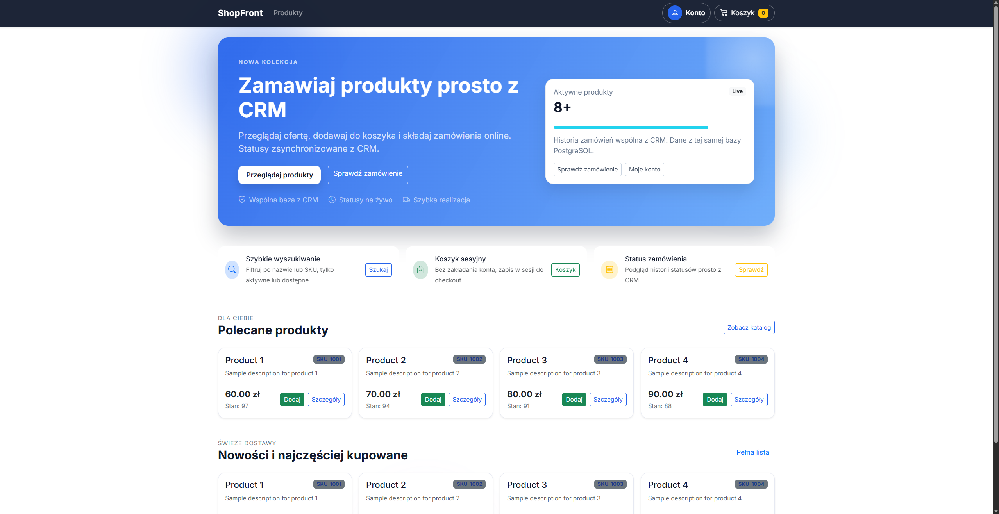

### Katalog produktow
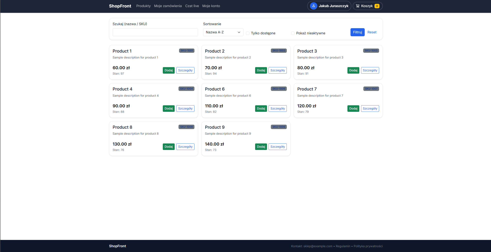

### Koszyk
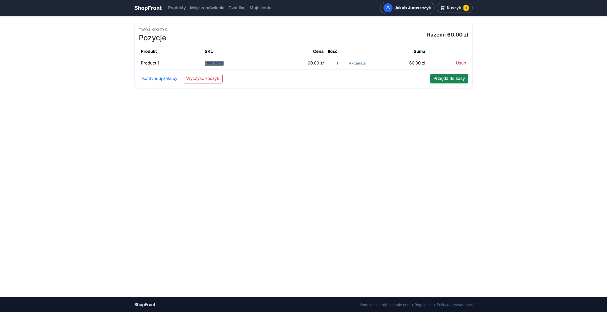

### Checkout (kasa)
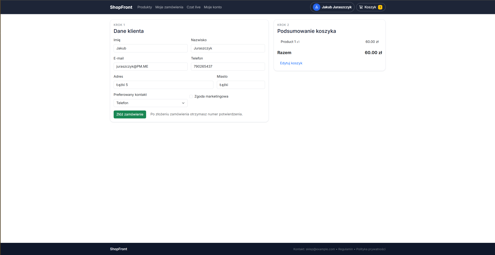

### Konto
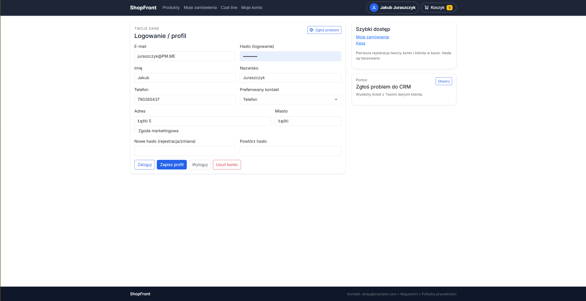

### Zamowienia
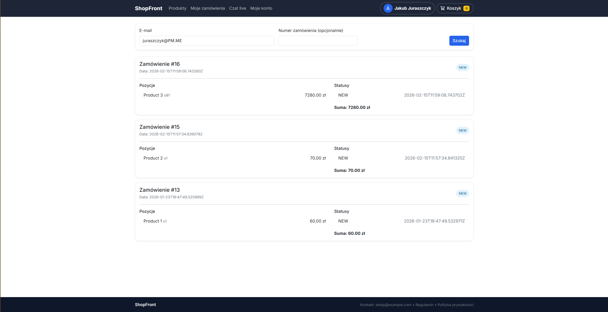

### Czat live
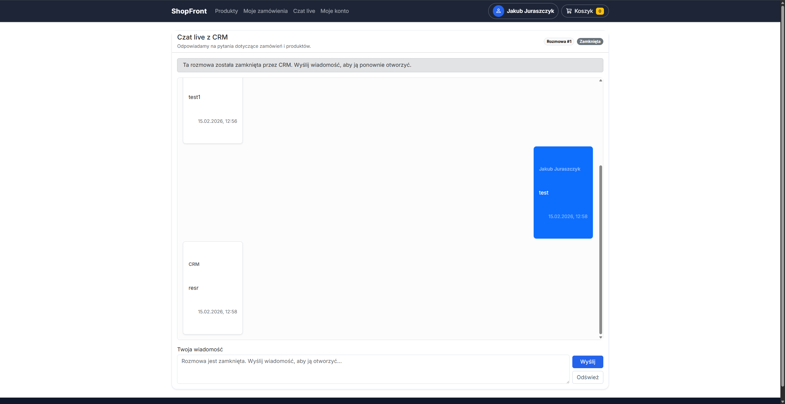

## Screenshoty - CRM

### Dashboard
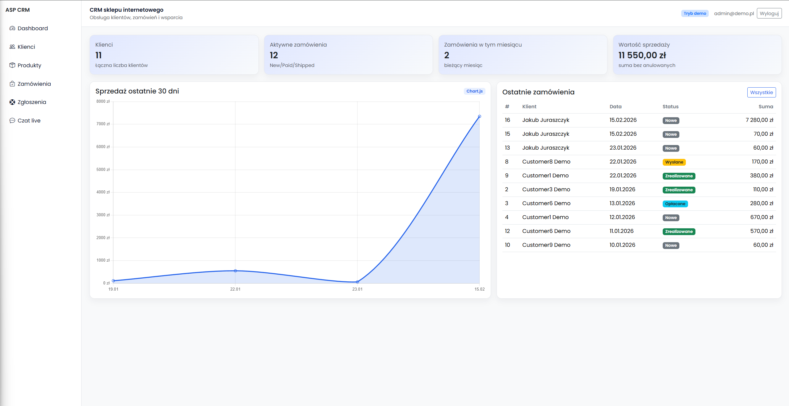

### Klienci
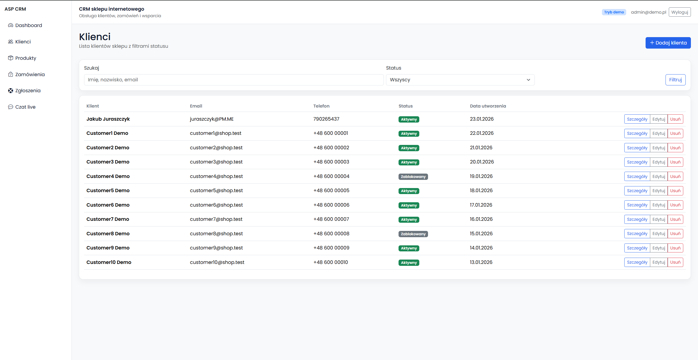

### Produkty
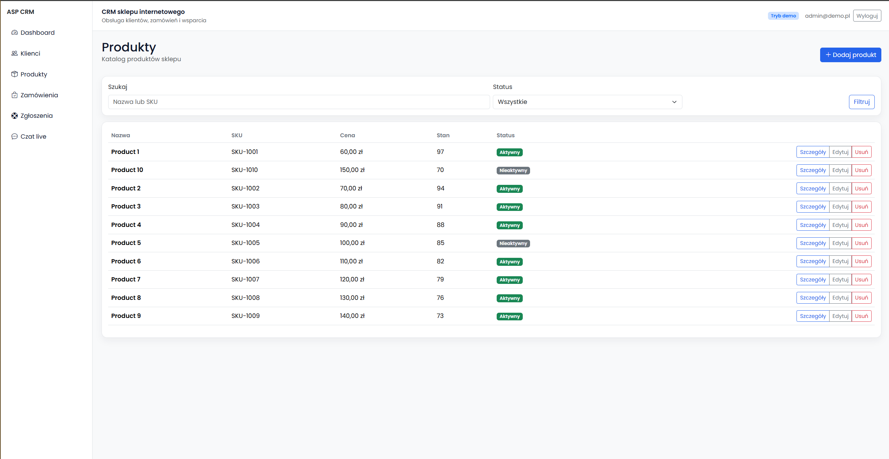

### Zamowienia
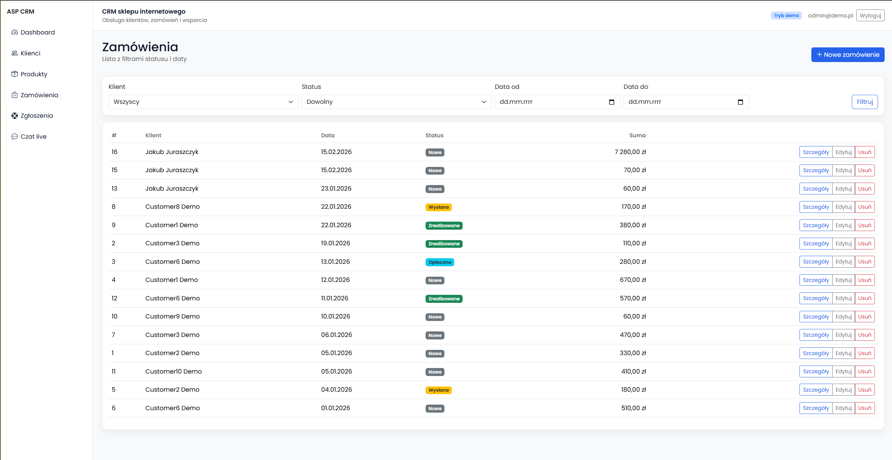

### Zgloszenia
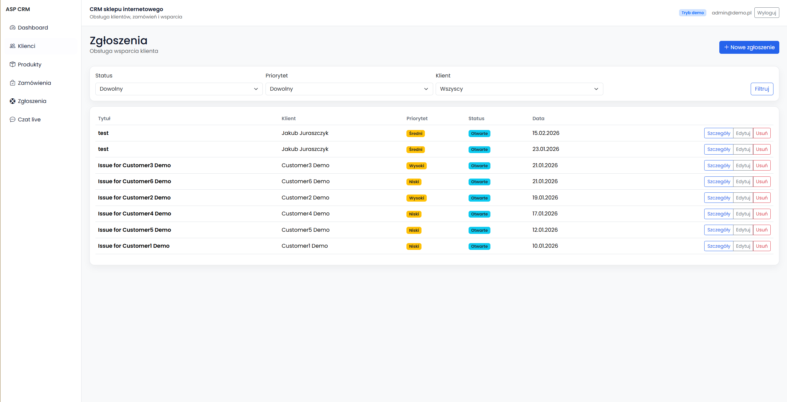

### Czat live
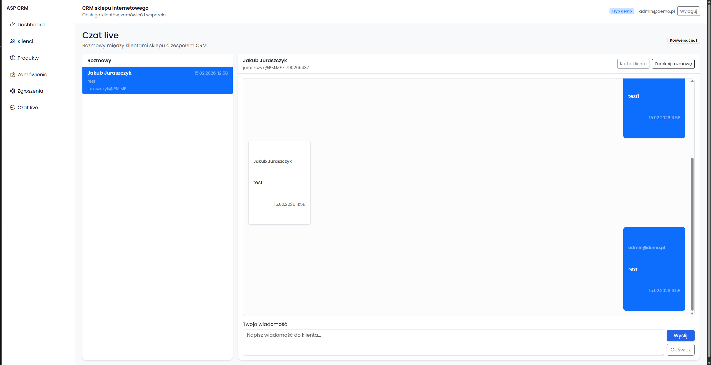
